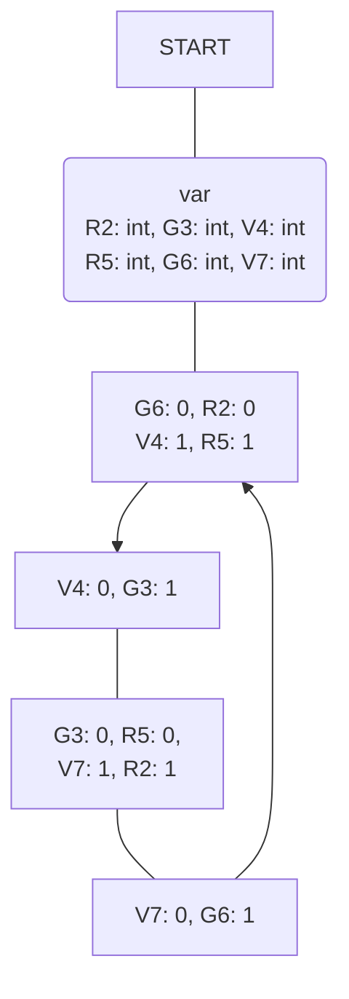

### Progetto - Impianto Semaforico Comandato "ISC" '24 
[Tinkercad Link](https://www.tinkercad.com/embed/iNOsuIANVeJ-impianto-semaforico-comandato?sharecode=BYYFi-NiwnCylbl8-Ms6OVTqQSeHWvafKt0LLMzby90)

---
### Diagramma di Flusso

